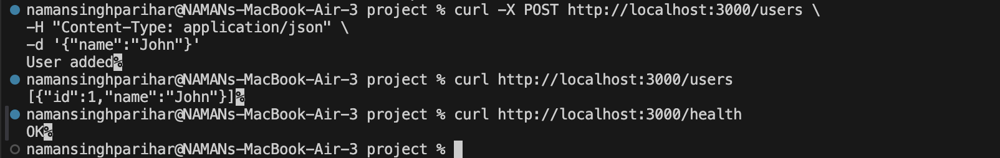

# Containerized Web Application with PostgreSQL

A containerized backend application built with **Node.js + Express** and **PostgreSQL**, deployed using **Docker** and **Docker Compose**.

---

## Project Overview

This project demonstrates how to build and run a multi-container web application using Docker.

The application consists of:

- a **backend API** developed using **Node.js and Express**
- a **PostgreSQL database** running in a separate container
- a **Docker Compose configuration** to manage both services together

The backend handles HTTP requests and interacts with the PostgreSQL database to store and retrieve user data.

---

## Objectives

The main goals of this project are:

- to containerize the backend application
- to run the database in a separate container
- to connect multiple containers using Docker networking
- to persist database data using Docker volumes
- to use Docker Compose for easier orchestration
- to optimize the backend image using a multi-stage build

---
## Screenshot Proofs

### 1) Docker Network Inspect


### 2) Docker Inspect Backend API


### 3) Docker Volume Inspection


### 4) Testing API Verification




---


## Technology Stack

### Backend
- Node.js
- Express.js
- PostgreSQL driver (`pg`)

### Database
- PostgreSQL

### DevOps / Containerization
- Docker
- Docker Compose

---

## Project Structure

```text
project
│
├── backend
│   ├── Dockerfile
│   ├── package.json
│   └── server.js
│
├── database
│   └── Dockerfile
│
├── docker-compose.yml
├── .dockerignore
├── .gitignore
└── README.md